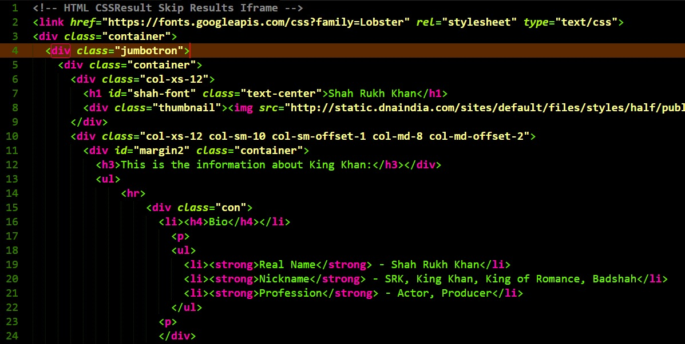
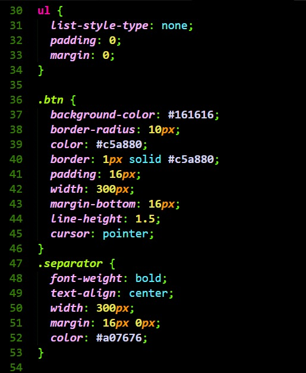
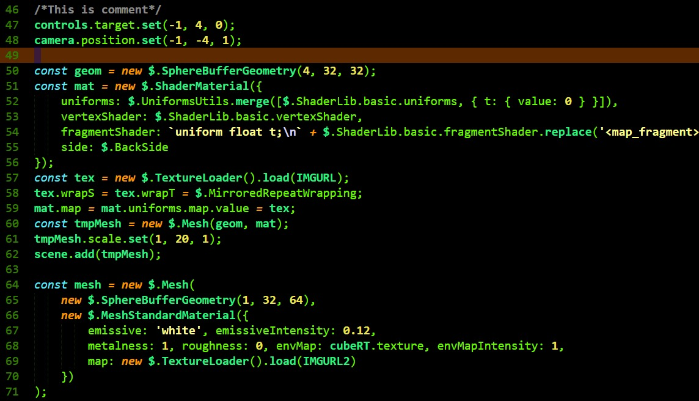
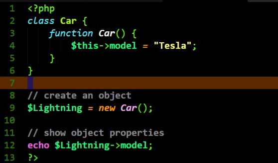
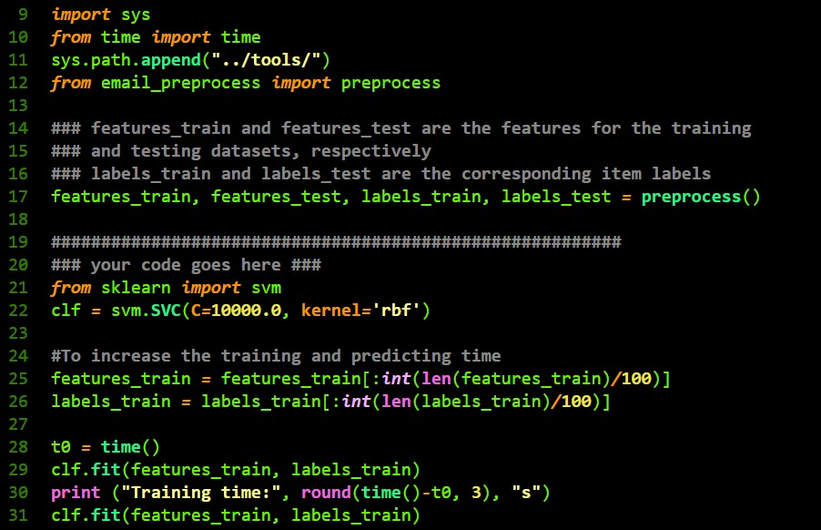

# Limegrass
🌱 A grassy and colorful over dark Sublime Text theme.

This theme is designed for front-end as well as back-end development, covering HTML, CSS, Javascript, PHP, Python and Markdown. Mileage may vary for other languages. Utilises both italics and bold weights for certain scopes.

*HTML*

*CSS*

*Javascript*

*PHP*

*Python*

## To-do

Convert to `sublime-color-scheme` format
